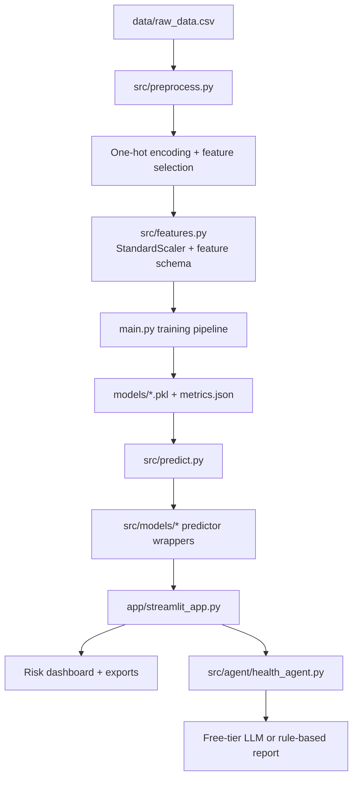

# Intelligent Patient Risk Assessment And Agentic Health Support System

An end-semester AI/ML project that combines five regression-based health risk models with an agentic report generator, interactive Streamlit dashboard, and export-ready outputs.

## Live App

[Streamlit Deployment](https://aihealthrisksystem5duvbgvx8pvz9xarixkmhgi.streamlit.app/)

## What The System Does

- Predicts five health risk scores on a `0-100` scale:
  - `diabetes_risk_score`
  - `heart_disease_risk_score`
  - `hypertension_risk_score`
  - `obesity_risk_score`
  - `cholesterol_risk_score`
- Uses one shared dataset and one shared preprocessing pipeline for all five targets
- Shows Plotly gauge charts, comparative dashboards, and feature-contribution views
- Generates an AI health-support report using a free-tier LLM when configured
- Falls back to a rule-based report when no API key is available
- Exports results as PDF and JSON

## Architecture



## Project Structure

```text
AI_Health_Risk_System/
├── app/
│   ├── __init__.py
│   └── streamlit_app.py
├── data/
│   └── raw_data.csv
├── models/
│   ├── best_diabetes_model.pkl
│   ├── best_heart_model.pkl
│   ├── best_hypertension_model.pkl
│   ├── best_obesity_model.pkl
│   ├── best_cholesterol_model.pkl
│   ├── scaler.pkl
│   ├── feature_columns.pkl
│   └── metrics.json
├── notebooks/
│   └── train_remaining_models.ipynb
├── src/
│   ├── agent/
│   ├── models/
│   ├── utils/
│   ├── evaluate.py
│   ├── features.py
│   ├── predict.py
│   ├── preprocess.py
│   └── train.py
├── tests/
│   └── test_health_system.py
├── app.py
├── main.py
├── .env.example
├── COMMIT_PLAN.md
├── PROJECT_WORKFLOW.md
├── requirements.txt
└── runtime.txt
```

## Dataset

The dataset in `data/raw_data.csv` contains `97,297` records and `33` columns:

- `28` input features covering demographics, lifestyle, history, vitals, and lab markers
- `5` target risk scores for supervised learning

The system uses all 28 input features for all five risk models to keep training and inference consistent.

## Machine Learning Approach

- Problem type: multi-target healthcare risk regression
- Candidate models per target:
  - `LinearRegression`
  - `DecisionTreeRegressor`
- Selection rule:
  - lower `RMSE` wins
  - ties break on higher `R²`
- Shared preprocessing:
  - one-hot encoding for categorical features
  - `StandardScaler` fit on training data only
  - saved encoded feature schema for stable inference

## AI Report Layer

The agentic support system can use:

- `Groq` with `GROQ_API_KEY`
- `Google Gemini` with `GOOGLE_API_KEY`

If no API key is configured, the app still works and generates a structured rule-based report using the model outputs and built-in medical guidance snippets.

## Setup

```bash
git clone https://github.com/Himanshu197200/AI_Health_Risk_System.git
cd AI_Health_Risk_System
python -m venv .venv
source .venv/bin/activate
pip install -r requirements.txt
```

## Train The Models

```bash
python main.py
```

This creates or refreshes:

- `models/best_diabetes_model.pkl`
- `models/best_heart_model.pkl`
- `models/best_hypertension_model.pkl`
- `models/best_obesity_model.pkl`
- `models/best_cholesterol_model.pkl`
- `models/scaler.pkl`
- `models/feature_columns.pkl`
- `models/metrics.json`

## Run The App

```bash
streamlit run app.py
```

## Run Tests

```bash
python -m unittest tests/test_health_system.py
```

## Environment Variables

Copy `.env.example` to `.env` and set at least one provider if you want live LLM generation.

```bash
GROQ_API_KEY=your_groq_api_key_here
# or
GOOGLE_API_KEY=your_google_api_key_here
```

## Team Collaboration

The repository includes [`COMMIT_PLAN.md`](/Users/gr.priyk/Documents/New project/AI_Health_Risk_System/COMMIT_PLAN.md:1) with an exact four-member distribution plan and per-member git commands.

## Medical Disclaimer

This project is for educational and academic demonstration purposes only. It does not diagnose disease, prescribe treatment, or replace qualified medical advice.
